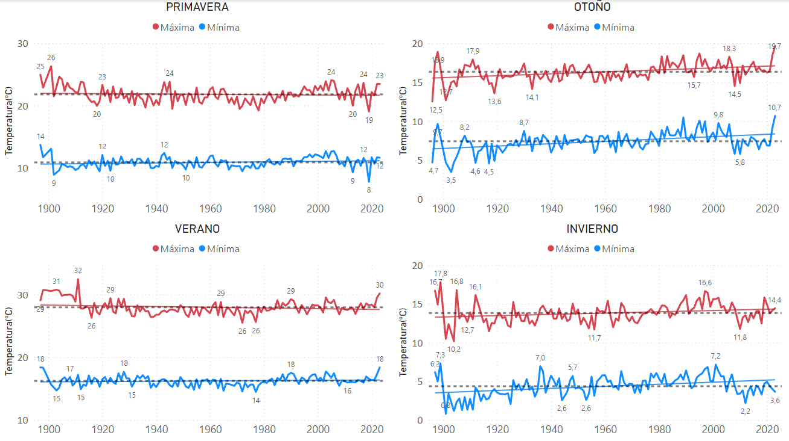

# ANÁLISIS DE LAS TEMPERATURAS HISTÓRICAS EN ESPAÑA   
## _Investigación exploratoria del mundo (España)_

¿Nos debería preocupar el aumto de las temperaturas en el mundo y, especialmente, en España? ¿Cómo es la tendencia desde que hay datos? ¿Cómo es la tendencia en los últimos años? ¿Es cierto que las temperaturas suben tanto como dicen? Pues sí y no. El problema reside en que cada vez que se escribe una noticia se coge el valor de crecimiento más alto (entre la tasa de crecimiento de las temperaturas máximas anuales o de las mínimas anuales). **En los últimos 126 años (desde 1897) las máximas han subido de media 1,18ºC y las mínimas 0,39ºC.**

### Descripción:

- Análisis de los registros de temperatura en España.
- Análisis de las estaciones meteorológicas en España.

### Proceso:

1. Descarga de datos de AEMET.
2. Limpieza y transformación de los datos para su correcta manipulación posterior.
3. Análisis exploratorio: ¿Qué nos cuentan los datos? Dificultad añadida: hay una cantidad muy grande de datos.
4. Agrupar por diferentes valores para ver el comportamiento.
5. Presentación en Microsoft Power BI Desktop.

### Conlusiones:

En primer lugar, cabe destacar la dificultad añadida de realizar este estudio. Hay muchísimos registros, hay muchos valores nulos y hay muchas estaciones que dejaron dee star operativas y otras empezaron a estar operativas más tarde por lo que la distribución de los datos no es homogénea. Incialmente traté de representar en una gráfica los más de 3.000.000 de registros y resulto ser ilegible (como era de esperar), entonces hice agrupaciones por estación meteorológica y posteriormente por mes. Después de realizar varias pruebas, la mejor opción y más representativa de la realidad era hacer groupby por año y mes y representar la evolución de cada mes con el paso de los años y hacer la media de las temperaturas (de las dos columnas: máximas y mínimas). Realizando este paso, me di cuenta que los meses más calurosos se comportaban de una manera muy similar y los meses más fríos de otra manera, así que finalmente decidí hacer una agrupación por estaciones del año. Lo represento en el primer gráfico.

Podemos observar que en verano y primavera, las temperaturas medias de cada año descienden ligeramente o se mantienen. En otoño e invierno las temperaturas sí que suben de manera más marcada.

Por último, realicé un gráfico de las medias globales por año y, efectivamente, las temperaturas están subiendo. Este gráfico lo representa: 

